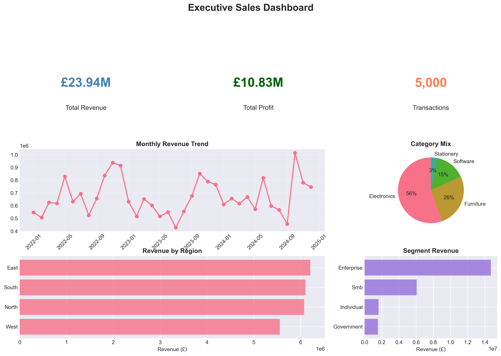
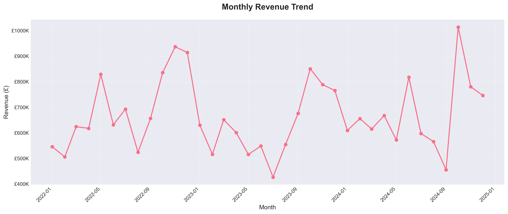

# 🚀 Getting Started - Complete Guide

**Welcome to your Business Intelligence Portfolio Project!**

This guide will help you maximize the impact of this project for job applications, interviews, and professional development.

---

## 📋 Table of Contents

1. [Quick Wins - What to Do Today](#today)
2. [GitHub Setup - Week 1](#github)
3. [LinkedIn & Applications - Week 2](#linkedin)
4. [Interview Prep - Ongoing](#interviews)
5. [Portfolio Extensions - Future](#future)
6. [Job Search Strategy](#strategy)

---

## 🎯 Quick Wins - What to Do Today <a id="today"></a>

### Priority 1: Review Your Work (30 minutes)

1. **Run the complete pipeline** to see it in action:
   ```bash
   cd sales-performance-dashboard
   pip install -r requirements.txt
   python scripts/data_generation.py
   python scripts/data_cleaning.py
   python scripts/kpi_calculations.py
   python scripts/visualizations.py
   ```

2. **Look at the outputs**:
   - Open `data/output/*.png` - These are your charts
   - Open `data/processed/*.csv` - This is your clean data
   - Read through one Python script - Understand the logic

3. **Understand the story**:
   - Read `PROJECT_SUMMARY.md` - This explains what you built
   - Read `QUICKSTART.md` - This is what you'll show employers

### Priority 2: Customize Your Documents (1 hour)

1. **Update README.md**:
   - Line 3: Add your actual LinkedIn and GitHub URLs
   - Section "Contact": Update with your info
   - Add a screenshot of one of your visualizations

2. **Personalize GITHUB_PROFILE_README.md**:
   - Replace all `#` links with your actual profile URLs
   - Add your photo URL if you have one
   - Update the "yourusername" in GitHub stats badges

3. **Review COVER_LETTER_TEMPLATE.md**:
   - Read through it
   - Bookmark 2-3 companies you want to apply to
   - Draft one complete cover letter using the template

### Priority 3: Practice Your Elevator Pitch (30 minutes)

Record yourself saying:

**"I built a comprehensive Business Intelligence project that demonstrates end-to-end analytics capabilities. The project includes 5,000 transactions analyzing £24 million in sales data. I created Python scripts for data cleaning and ETL, calculated 15+ KPIs including customer lifetime value and profit margins, generated 8 professional visualizations, and designed complete Power BI specifications with DAX measures. This project showcases the exact skills BI analyst roles require—data pipelines, KPI design, visualization, and business storytelling."**

Practice until you can say this naturally in under 60 seconds.

---

## 💻 GitHub Setup - Week 1 <a id="github"></a>

### Step 1: Create Your GitHub Repository

1. **Go to GitHub.com** → Sign in or create account
2. **Click "New Repository"**
   - Name: `sales-performance-dashboard`
   - Description: "End-to-end Business Intelligence project: ETL, KPI calculations, data visualization, and Power BI specifications"
   - Public repository
   - Don't initialize with README (you already have one)

3. **Push your project**:
   ```bash
   cd sales-performance-dashboard
   git init
   git add .
   git commit -m "Initial commit: Complete BI analytics project"
   git branch -M main
   git remote add origin https://github.com/YOUR-USERNAME/sales-performance-dashboard.git
   git push -u origin main
   ```

### Step 2: Enhance Your Repository

1. **Add Topics/Tags** (Repository → Settings → Topics):
   - `business-intelligence`
   - `data-analytics`
   - `power-bi`
   - `python`
   - `data-visualization`
   - `etl`
   - `kpi-dashboard`

2. **Create a Release**:
   - Go to Releases → "Create a new release"
   - Tag: `v1.0.0`
   - Title: "Initial Release - Sales Performance Dashboard"
   - Description: "Complete BI analytics project with data generation, ETL, KPIs, and visualizations"

3. **Add Screenshots to README**:
   - Upload 2-3 visualization PNGs to your repo
   - Edit README.md to include them:
   ```markdown
   ## Sample Visualizations
   
   
   
   ```

### Step 3: Create Your GitHub Profile README

1. **Create a new repository** named exactly as your username
2. **Upload GITHUB_PROFILE_README.md** as README.md in that repo
3. **Customize it** with your actual links and information
4. **Add a professional photo** if you have one

### Step 4: Pin Your Best Projects

1. Go to your GitHub profile
2. Click "Customize your pins"
3. Select "sales-performance-dashboard" and up to 5 other projects
4. These will show prominently on your profile

---

## 💼 LinkedIn & Applications - Week 2 <a id="linkedin"></a>

### Update Your LinkedIn Profile

1. **Headline**:
   - Current: Just your title
   - Better: "Business Intelligence Analyst | Power BI | Python | Data Analytics | Building data-driven solutions at Frencon Construction"

2. **About Section** (first 3 lines are crucial):
   ```
   Business Intelligence Analyst specializing in Power BI dashboards, KPI design, and data-driven decision making.
   
   Currently at Frencon Construction, I create comprehensive data systems that transform raw data into actionable insights for marketing, operations, and client engagement.
   
   🔹 Technical: Power BI (DAX, Power Query, Power Automate) | Python (Pandas, NumPy, Matplotlib) | SQL | Excel
   🔹 Analytics: ETL Pipelines | Data Modeling | KPI Design | Statistical Analysis | Data Visualization
   🔹 Recent Project: Built complete BI analytics pipeline with 15+ KPIs and professional visualizations
   
   MSc Computer Science (Distinction) | Available for BI Analyst and Data Analyst opportunities
   ```

3. **Featured Section**:
   - Add link to your GitHub project
   - Add link to your portfolio website if you have one
   - Upload your best visualization as a media item

4. **Projects Section**:
   Add "Sales Performance Dashboard":
   - Description: Use the summary from PROJECT_SUMMARY.md
   - Link to GitHub
   - Add collaborators: None (all your own work)

5. **Skills** (Add/Endorse):
   - Power BI ⭐⭐⭐
   - Data Analysis ⭐⭐⭐
   - Python ⭐⭐⭐
   - SQL ⭐⭐⭐
   - Data Visualization ⭐⭐⭐
   - Business Intelligence ⭐⭐⭐

### Job Application Strategy

1. **Target 3-5 Companies This Week**:
   - Research each company (30 min minimum)
   - Customize cover letter using the template
   - Update CV to highlight relevant skills
   - Apply through company website AND LinkedIn

2. **Application Checklist**:
   - [ ] Cover letter mentions specific company details
   - [ ] CV highlights Power BI and relevant projects
   - [ ] LinkedIn profile is complete and current
   - [ ] GitHub project link included in application
   - [ ] Reference to your project portfolio

3. **Track Your Applications** (Spreadsheet):
   | Company | Position | Date Applied | Status | Follow-up Date |
   |---------|----------|--------------|--------|----------------|
   | | | | | |

---

## 🎤 Interview Prep - Ongoing <a id="interviews"></a>

### Week-by-Week Preparation

**Week 1: Master Your Project**
- [ ] Run all scripts and understand every step
- [ ] Practice explaining each component
- [ ] Memorize key metrics (5,000 transactions, £24M revenue, etc.)
- [ ] Can screen-share and walk through in 5 minutes

**Week 2: Technical Review**
- [ ] Review DAX formulas in powerbi/dashboard_template.md
- [ ] Practice writing SQL queries
- [ ] Review Python Pandas operations
- [ ] Study your data_cleaning.py logic

**Week 3: Behavioral Prep**
- [ ] Write STAR responses for 5-10 common questions
- [ ] Practice out loud (record yourself)
- [ ] Get feedback from a friend/mentor
- [ ] Time yourself—keep answers to 2-3 minutes

**Week 4: Mock Interviews**
- [ ] Schedule mock interview with friend
- [ ] Practice on Pramp or similar platform
- [ ] Record yourself and review
- [ ] Refine weak areas

### Interview Day Checklist

**Tech Setup (15 mins before)**:
- [ ] Test camera and microphone
- [ ] Close unnecessary apps and browser tabs
- [ ] Open GitHub project in one tab
- [ ] Have visualization PNGs ready to share
- [ ] Glass of water nearby

**Mental Prep**:
- [ ] Review your elevator pitch
- [ ] Look at company website one more time
- [ ] Read your notes on why you want this job
- [ ] Take 5 deep breaths

**After Interview**:
- [ ] Send thank-you email within 24 hours
- [ ] Note what went well and what to improve
- [ ] Update application tracking sheet
- [ ] Follow up in 1 week if no response

---

## 🔮 Portfolio Extensions - Future <a id="future"></a>

### Quick Wins (Add These Next)

1. **Add Real Database Connection** (3-4 hours):
   - Set up local PostgreSQL
   - Load cleaned data into database
   - Write SQL queries to generate same insights
   - Add SQL code to your repo

2. **Build Streamlit Dashboard** (4-5 hours):
   - Create interactive web app
   - Deploy to Streamlit Cloud (free)
   - Add URL to your GitHub README
   - Now you have a live demo!

3. **Add Machine Learning** (5-6 hours):
   - Build a sales forecasting model
   - Create customer segmentation (K-means clustering)
   - Predict customer churn
   - Document in new notebook

4. **Create Video Walkthrough** (2-3 hours):
   - Record 5-minute Loom/YouTube video
   - Walk through your project
   - Show visualizations and explain insights
   - Add link to README

### Advanced Projects (Later)

1. **Industry-Specific Project**:
   - Healthcare: Patient outcomes dashboard
   - Retail: Inventory optimization
   - Finance: Portfolio analysis
   - Marketing: Campaign attribution

2. **Real Data Project**:
   - Find public dataset (Kaggle, govt open data)
   - Build end-to-end analysis
   - Write medium article about findings

3. **Collaborative Project**:
   - Contribute to open-source BI tools
   - Join a hackathon
   - Partner with someone on joint project

---

## 💼 Job Search Strategy <a id="strategy"></a>

### Where to Look

**Best Job Boards for BI Roles**:
- LinkedIn Jobs (set up alerts)
- Indeed UK
- Glassdoor
- Reed.co.uk
- CWJobs (tech-focused)
- Company websites directly

**Target Companies**:

**Consulting Firms**:
- Deloitte, PwC, KPMG, EY (Analytics practices)
- Accenture, McKinsey Analytics
- Smaller boutique consultancies

**Tech Companies**:
- Google, Amazon, Microsoft (BI Analyst roles)
- SaaS companies (Salesforce, HubSpot, etc.)
- FinTech startups

**Traditional Industries**:
- Banks (Barclays, HSBC, Lloyds)
- Retail (Tesco, M&S, ASOS)
- Healthcare (NHS Digital, private healthcare)
- Construction (similar to your current role)

### Keywords to Search

- "Business Intelligence Analyst"
- "BI Analyst"
- "Data Analyst"
- "Analytics Analyst"
- "Reporting Analyst"
- "Power BI Developer"
- "Business Analyst" (with data focus)

### Networking Strategy

**Online**:
- Comment on BI-related LinkedIn posts
- Join "Power BI Users Group" or similar
- Follow BI thought leaders
- Share your project on LinkedIn

**In-Person**:
- Attend London BI/Data meetups
- Join professional organizations (e.g., TDWI)
- Connect with recruiters specializing in data roles

### Application Velocity

**Recommended Pace**:
- **Week 1-2**: 5-10 applications (high-quality, customized)
- **Week 3-4**: 10-15 applications (mix of reach and realistic)
- **Month 2+**: 15-20 applications weekly

**Quality vs Quantity**:
- Aim for 80% customized applications
- 20% can be "spray and pray" for volume
- Track everything in your spreadsheet

### Follow-Up Protocol

**Timeline**:
- Day 0: Submit application
- Day 3-5: Connect with hiring manager on LinkedIn (no message needed)
- Day 7: If no response, send polite follow-up email
- Day 14: If still no response, move on (but keep application active)

**Sample Follow-Up Email**:
```
Subject: Following up - BI Analyst Application

Hi [Name],

I applied for the Business Intelligence Analyst position on [date] and wanted to express my continued strong interest.

I've recently completed a comprehensive BI project [link] demonstrating the exact skills you're looking for—Power BI dashboards, KPI design, and data pipelines.

I'd welcome the opportunity to discuss how I can contribute to [Company]'s analytics team.

Best regards,
Nency Faganiya
```

---

## ✅ 30-Day Action Plan

### Week 1: Foundation
- [ ] Set up GitHub repository
- [ ] Create/update LinkedIn profile
- [ ] Draft 3 cover letters for target companies
- [ ] Apply to 5 jobs
- [ ] Practice elevator pitch daily

### Week 2: Outreach
- [ ] Apply to 10 more jobs
- [ ] Connect with 20 relevant people on LinkedIn
- [ ] Attend 1 data/BI meetup or webinar
- [ ] Start interview prep from guide
- [ ] Record yourself doing mock interview

### Week 3: Deep Prep
- [ ] Apply to 10 more jobs
- [ ] Complete all STAR responses
- [ ] Practice project walkthrough 3x
- [ ] Review technical concepts (DAX, SQL, Python)
- [ ] Research each company you applied to

### Week 4: Polish
- [ ] Apply to 10 more jobs
- [ ] Do 2 mock interviews
- [ ] Create Streamlit demo (optional)
- [ ] Write LinkedIn post about your project
- [ ] Follow up on earlier applications

---

## 🎯 Success Metrics

Track these weekly:
- **Applications Sent**: Target 10-15/week
- **Responses Received**: Expect 10-20% response rate
- **Interviews Scheduled**: Aim for 2-3/week after month 1
- **LinkedIn Connections**: Grow by 20-30/week
- **GitHub Profile Views**: Should increase over time

---

## 💪 Final Motivation

**You have**:
✅ A complete, professional BI project  
✅ Real experience at Frencon Construction  
✅ Strong educational background (MSc with Distinction)  
✅ Multiple programming languages and tools  
✅ Diverse project portfolio (BI, ML, Full-Stack)  

**You're ready to**:
🎯 Apply to BI Analyst roles confidently  
🎯 Discuss your work technically and professionally  
🎯 Demonstrate real, tangible skills  
🎯 Stand out from other candidates  

**Remember**:
- Job searching is a numbers game—don't get discouraged
- Every "no" gets you closer to "yes"
- Your project portfolio sets you apart
- Keep improving and learning

---

## 📞 Need Help?

If you get stuck:
1. **GitHub Issues**: Check if others had similar problems
2. **Stack Overflow**: Search for specific technical questions
3. **LinkedIn**: Reach out to BI professionals for advice
4. **Mentorship**: Consider finding a mentor in the field

---

**Now go get started! Pick one task from the "Quick Wins" section and complete it today. 🚀**

Good luck with your job search! You've got this! 💪
